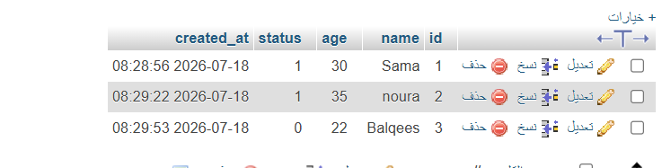

# MySQL-Live-Toggle-Task
 A simple full-stack web application that connects a frontend interface (HTML, CSS, JavaScript) with a MySQL database using PHP. It allows users to insert new records and dynamically toggle their status without reloading the page.

🔗 Live Project Link: [Click here to visit the live website]([https://first-task.infinityfreeapp.com/]

## Tech Stack
- HTML / CSS
- JavaScript
- PHP
- MySQL
- InfinityFree

## Features
- Add new users.
- Display users from the MySQL database.
- Toggle user status between 0 and 1.
- Update the status instantly using AJAX without reloading the page.

## How It Works
1. Created a MySQL database with a users table.
2. Connected PHP to the database using mysqli.
3. Displayed records dynamically using standard SELECT and fetch_assoc().
4. Added a form to insert new users.
5. Used AJAX to update the user's status without refreshing the page.

## Database Preview
 

## Application Preview

